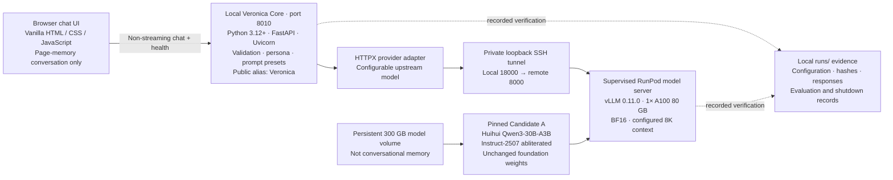

# Veronica.v4 — whiteboard guide assets

Date: 2026-08-31. Background reference for a future guide; not canonical implementation direction.

## Image index

Three selected PNGs are complete and visually reviewed. The precise media blueprint also has an editable SVG. Dropbox verification is recorded separately in the task run evidence.

| Filename | Meaning |
| --- | --- |
| `01-current-tech-stack.png` | Implemented architecture, with previously verified inference clearly separated from present live status. |
| `02-future-agent-handoffs.png` | Concept: permissioned orchestration, bounded worker tasks, evidence-bearing handoffs and owner review. |
| `03-future-image-video-pipeline.png` | Precise concept blueprint: shared approval, separate image/video workers, optional still-to-keyframe input, reviewed library and export. |
| `03-future-image-video-pipeline.svg` | Editable vector version of the same media blueprint. |

The two future boards are architecture proposals, not an adopted build plan. Their components and integrations are not claims of implemented Veronica capabilities. The canonical direction remains core-first qualification before expansion.

## Current architecture — editable reference

The diagram describes the implemented/recorded deployment path, not a currently running service. The health endpoint reports wrapper readiness separately from provider connectivity. Chat, Deep Reasoning, Creative and Coding are prompt presets; their labels do not establish native reasoning controls.

Candidate repository: `huihui-ai/Huihui-Qwen3-30B-A3B-Instruct-2507-abliterated`.

Immutable revision: `e2f73ec7e99ee316beb8069ca90e4c3cbef8aa0f`.

## Evidence boundary

- Real API/UI chat and a supervised cold restart were previously verified. The recorded run ended with confirmed Pod termination and retained model storage.
- No live Veronica service or RunPod inventory was checked for this visualization task. No Veronica inference, startup, benchmark or RunPod compute was initiated. The artwork uses separate built-in image generation.
- Foundation qualification and final model selection remain pending; smoke success is not broad capability acceptance.
- Streaming, browser-session persistence, native tool execution, scoped memory, agent execution and image/video generation are not implemented in the current core. There is no application database in this architecture.
- Future memory stores approved, attributed information; it must not imply automatic weight training. Any future adapter remains separate and gated by evaluation.
- Current per-run controls require fresh owner authorization, a bounded deadline, one A100 and a $1.75/hour ceiling. Supervision/local backup is not a platform-enforced termination guarantee.

## Source references

Paths below are relative to this guide directory.

- [Canonical source of truth](../../../docs/SOURCE-OF-TRUTH.md): identity, provisional model selection, prompt-preset boundary and future media-tool separation.
- [Execution TODO](../../../TODO.md): implemented versus pending milestones, tools, memory and Studio Director.
- [Latest recorded startup decision](../../../runs/2026-08-31T034034Z-start-veronica/decision.md): real chat/restart evidence, quality failures, UI-first change and confirmed shutdown.
- [Evaluation foundation decision](../../../runs/2026-08-31-evaluation-foundation/decision.md): 60 cases/69 turns, offline harness scope and qualification limits.
- [Runtime/model profile](../../../config/runpod-core.json): candidate revision, GPU, volume, pinned runtime and development controls.
- [Python package configuration](../../../pyproject.toml): Python, FastAPI, HTTPX and Uvicorn dependencies.
- [Wrapper implementation](../../../src/veronica_core/app.py): API endpoints, validation, alias mapping, capability reporting and non-streaming behavior.
- [Provider configuration](../../../src/veronica_core/config.py): configurable upstream model and connection settings.
- [Browser implementation](../../../src/veronica_core/static/app.js): page-memory messages, health checks and real UI event reporting.
- [Checked launcher](../../../scripts/start-veronica.ps1): local wrapper, private tunnel and supervised startup sequence.

For future guide editing, preserve the CURRENT versus CONCEPT labels and the verification caveats when cropping or reusing individual boards.

## Reusable prompts

The first two whiteboards use built-in image generation. The media blueprint is a new deterministic drawing with editable vector source; it is not an edit of an AI-generated image. The visualize skill guided flow composition and the editable Mermaid references; PNG exports follow the owner's request for reusable image files. Draft generative media illustrations were not selected because their connector routing was unreliable.

- [Current stack prompt](01-current-tech-stack.prompt.txt)
- [Agent-handoff prompt](02-future-agent-handoffs.prompt.txt)
- [Exact media pipeline map](03-future-image-video-pipeline.mmd)
- [Editable media blueprint](03-future-image-video-pipeline.svg)
- [Blueprint rendering source](04-render-creative-blueprint.ps1)
